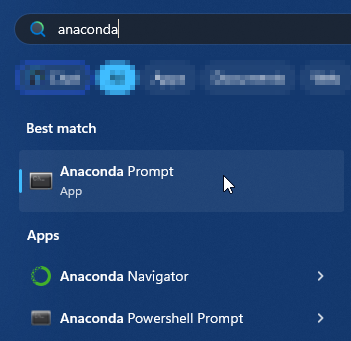
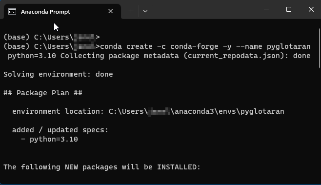
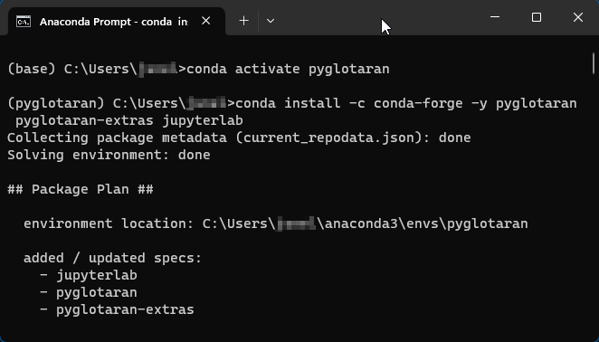
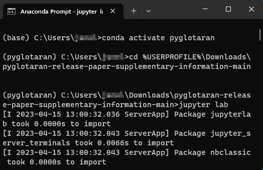

# pyglotaran-release-paper-supplementary-information

[](https://doi.org/10.5281/zenodo.7658982)

Supplementary Information (SI) to the pyglotaran release paper

## Getting started with this repository

This readme describes the steps needed to run the jupyter notebooks provided as supplementary information to the publication `pyglotaran: a lego-like Python framework for global and target analysis of time resolved spectra`.

If you already have a Python 3.10 (virtual environment) on your computer, or you know how to setup one, skip to step 3.

### 1. Setting up Python with Anaconda

Download Anaconda from its [official website](https://www.anaconda.com/).

Pick the installer that's appropriate for your operating system.
It is assumed you install with default settings.

### 2. Setting up a Python virtual environment

Start an Anaconda Prompt or shell.



You should see a terminal windows open in the (base) environment.

Type the following command to create a new standalone environment for pyglotaran.

```console
conda create -c conda-forge -y --name pyglotaran python=3.10
```



Following the instructions in step 3 to activate the environment and install dependencies.

### 3. Installing dependencies to run the notebooks

Activate the pyglotaran environment (created in step 2), e.g. by executing in your Anaconda Prompt or shell:

```console
conda activate pyglotaran
```

Your prompt should now reflect that you are in the pyglotaran environment.



Now you can install the necessary packages, by executing the following command.

```console
conda install -c conda-forge -y pyglotaran pyglotaran-extras jupyterlab
```

Alternatively (if you are more familiar with it) you can install using pip as well (but don't do both):

```console
pip install pyglotaran pyglotaran-extras jupyterlab
```

<sub>Note: the main package is `pyglotaran`, `pyglotaran-extras` provides additional plotting functionality, whereas `jupyterlab` provides a way to work with notebooks.</sub>

### 4. Start Jupyter notebook within Supplementary Information folder

From within your Anaconda Prompt or shell, navigate (using the command `cd` for 'change directory') to the location where you downloaded **and extracted** the archive `pyglotaran-release-paper-supplementary-information.zip` (or `.7z`).

For example under Windows, assuming you downloaded and extracted the archive into your Downloads folder, type:

```cmd
cd %USERPROFILE%\Downloads\pyglotaran-release-paper-supplementary-information-main
```

On Mac OS X or Linux

```sh
cd ~/Downloads/pyglotaran-release-paper-supplementary-information-main
```

Where `pyglotaran-release-paper-supplementary-information-main` is the name of the folder you extract from the (`.zip`|`.7z`) archive.

Then start Jupyter Lab by executing the command:

```console
jupyter lab
```



### 5. Notes on order of notebook evaluation

The **first** case study **`Broadband absorption case study of intersystem crossing in 4-thiothymidine`** is covered by the notebook:

- `4TT/sequential_doas_4TT.ipynb`

The **second** case study **`Transient absorption case study of the chromophoric systems rc and rcg`** is covered by the notebooks inside the `rc` folder.

For this case study, it is important to execute the notebooks in order:

1. `rc/target_rc_part1.ipynb`
2. `rc/target_rcg_compare_part2.ipynb`
3. `rc/target_rcg_gcrcg_rcgcr_refine_part3.ipynb`

The **third** case study **`Time-resolved emission case study of whole photosynthetic cells`** is covered by the notebook:

- `dPSI/ex_four_datasets_two_guidance_with_area_irf-with_sum_plot_minimal.ipynb`

### 6. Future updates

Future updates on the usage of the current version of pyglotaran or these case studies will be uploaded to the github repository located here:

- https://github.com/glotaran/pyglotaran-release-paper-supplementary-information

For each (new) release of pyglotaran, there will be a corresponding release of the updated notebooks reflecting the usage with that version of pyglotaran.

More information on the most recent version of `pyglotaran` and `pyglotaran-extras` can be found via their respective github repository pages:

- https://github.com/glotaran/pyglotaran
- https://github.com/glotaran/pyglotaran-extras

## License

Except where otherwise noted, the work in this repository is dual-licensed:

- The source code is available under the ([MIT License](https://spdx.org/licenses/MIT.html))
- Documentation, text, figures, etc, are licenses under `Creative Commons Attribution 4.0 International` [(CC-BY-4.0)](https://spdx.org/licenses/CC-BY-4.0.html). You can attribute them by citing the pyglotaran publication accompanying this supplementary information.

These licenses are provided in plain text as a convenience to the user as [LICENSE](LICENSE) and [LICENSE-CC-BY](LICENSE-CC-BY) respectively.

[](https://opensource.org/license/mit/)
[](https://creativecommons.org/licenses/by/4.0/)
